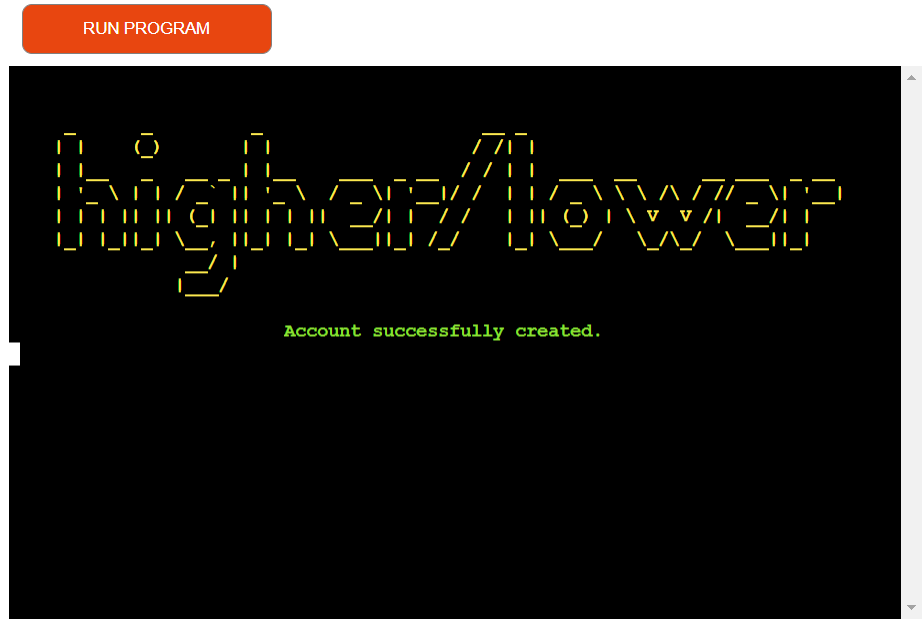
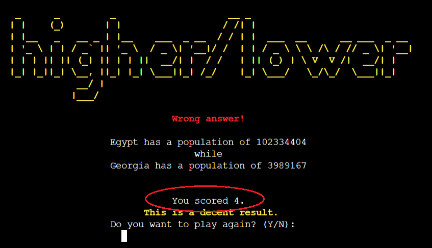
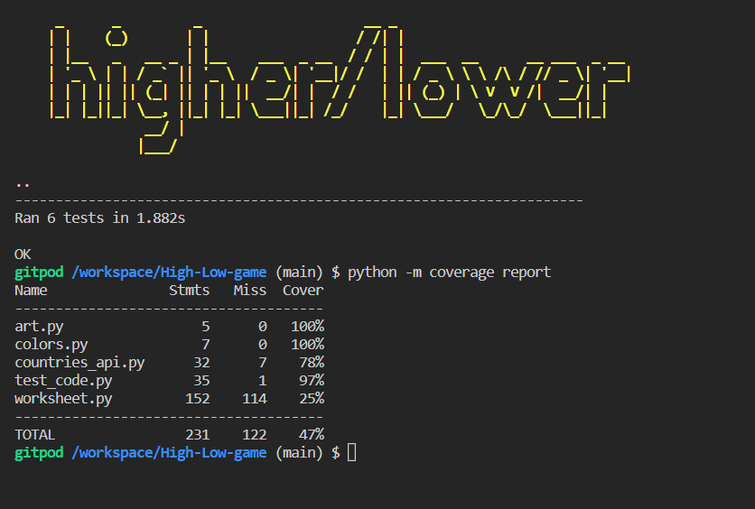

# Higher/Lower Game

[Visit live website](https://high-low-cipp3.herokuapp.com/)

## About

This is a command-line version of the classic Higher/Lower Game.

The purpose of the game is to guess the higher value, in this case the country population, and have a winning streak as high as possible witch counts as your score.

This particular version of the game gives you the ability to create an account and have your highest score stored.

## Table of Contents
  - [Project Goals](#project-goals)
    - [User Goals](#user-goals)
    - [Site Owner Goals](#site-owner-goals)
  - [User Experience](#user-experience)
    - [Target Audience](#target-audience)
    - [User Requirements and Expectations](#user-requirements-and-expectations)
    - [User Manual](#user-manual)
  - [User Stories](#user-stories)
    - [Users](#users)
    - [Site Owner](#site-owner)
  - [Technical Design](#technical-design)
    - [Flowchart](#flowchart)
  - [Technologies Used](#technologies-used)
    - [Languages](#languages)
    - [Frameworks & Tools](#frameworks--tools)
    - [Libraries](#libraries)
  - [Features](#features)
  - [Validation](#validation)
  - [Testing](#testing)
    - [Manual Testing](#manual-testing)
    - [Automated Testing](#automated-testing)
  - [Bugs](#bugs)
  - [Deployment](#deployment)
  - [Credits](#credits)
  - [Acknowledgements](#acknowledgements)

## Project Goals

### User Goals

- Play a fun and easy game
- Test your knowledge of geography
- Be able to log in to an existing account

### Site Owner Goals

- Create a game that is easy and clear to user
- Ensure that users understand the purpose of the game
- Create a game that gives feedback to the user whilst playing

## User Experience

### Target Audience

There is no specific audience of this game.

### User Requirements and Expectations

- A simple, error-free game
- Straightforward navigation
- Game personalisation by entering players' names
- Feedback on game result

### User Manual

Click here to view instructions

  #### Main Menu
  On the main menu, users are presented with an ASCII art rendering of the name 'Higher/Lower'. Below the graphic the user is greet with a welcome message and asked if he is a returning user. The user can answer the question by typing "y" for yes or "n" for no. If anything else is typed, it will be asked to try again

  At any point of the game, if the user inputs somethig which do not correspond to the suggested options then they will be prompt to try again.

  #### New account
  If the user answer with no to the first question, then he will be asked to create a new account by entering a username and a passcode

  #### Log-in
  If user answer with yes to the "Are you a returning user?" question, then he must provide an existing username and a corresponding passcode.

  #### Play
  After the account creation or after a successful log in, the game starts.
  The question is printed to the terminal and the user must answer again with yes or no. This repeats until a wrong answer is given. Then the score is printed together with both countries populations.
  The option to replay is given to the user. If he chooses not to play again, then the top 5 scores are printed to the terminal

## User Stories

### Users

1. I want to have clear options to select when prompted
2. I want to be able to read the rules of the game
3. I want to personalise the game and enter my name
4. I want to be able to log-in if I return to the game
5. I want to receive a real time feedback throughout the game
6. I want to get a feedback after each answer
7. I want to be able to play multiple games when I'm logged in
8. I want to see my score

### Site Owner

9. I want users to have a positive experience whilst playing the game
10. I want users to easily navigate the game
11. I want user accounts to be saved to Google Spreadsheet
12. I want the user to get feedback in case of wrong input
13. I want data entry to be validated, to guide the user on how to correctly format the input

[Back to Table Of Contents](#table-of-contents)

## Technical Design

### Flowchart

The following flowchart summarises the structure and logic of the application.

Flowchart

## Technologies Used

### Languages

- [Python](https://www.python.org/) programming language for the logic of the program

### Frameworks & Tools

- [Lucid.net](https://lucid.app/) was used to draw program flowchart
- [Git](https://git-scm.com/) was used for version control within VSCode to push the code to GitHub
- [GitHub](https://github.com/) was used as a remote repository to store project code
- [Google Cloud Platform](https://cloud.google.com/cloud-console/) was used to manage access and permissions to the Google Services such as Google auth, sheets etc.
- [Google Sheets](https://www.google.co.uk/sheets/about/) were used to store users details
- [Word Population API](https://rapidapi.com/aldair.sr99/api/world-population/) Used to get all countries populations
- [Heroku Platform](https://dashboard.heroku.com/) was used to deploy the project into live environment
- [PythonChecker](https://www.pythonchecker.com/) was used to check my code against Python conventions
- [Visual Studio Code (VSCode)](https://code.visualstudio.com/)
VSCode was used to write the project code using Code Institute template

### Libraries

#### Python Libraries
- random - used to shuffle the country list
- time - used to displayed delayed messages in the terminal
- [unittest](https://docs.python.org/3/library/unittest.html) - used to carry out testing on single units in code_testing.py file

#### Third Party Libraries
- [requests](https://pypi.org/project/requests/) - Used to access the API data in a json format
- [colorama](https://pypi.org/project/colorama/) - I used this library to add color to the terminal and enhance user experience. I marked warning/error information with color red and user feedback with blue and green
- [pwinput](https://pypi.org/project/pwinput/) - Used to hide characters when the user enters the password
- [gspread](https://docs.gspread.org/en/latest/) - I used gspread to add and manipulate data in my Google spreadsheet and to interact with Google APIs
- [google.oauth2.service_account](https://google-auth.readthedocs.io/en/master/) - Module used to set up the authentification needed to access the Google API and connect my Service Account with the Credentials function. A creds.json file is created with all details the API needs to access the google account. In deployment to heroku this information is stored in the config var section.

[Back to Table Of Contents](#table-of-contents)

## Features

### Welcome message

- Provides user with a welcome message
- Gives user option to log-in or to create a new account
- User stories covered: 9
 

    
Welcome Screenshot

### Game Instructions
- Displays clear simple game instructions
- User stories covered: 2
  

    
Game instructions Screenshot

### Log-in
- Asks users for their username
- Informs them if the username in not registered
- Asks users for their passcode
- Gives users alternative to start over and create a new account if can not remenber the passcode
- If correct, access their data from the Google Spreadsheet
- User stories covered: 4

    
Log-in Screenshot

    
Alternative Log-in Screenshot

### Account creation
- Asks user for a new username and a passcode
- Validates user input values
- Informs user if the username is already taken
- User account will be saved to Google Spreadsheet after creation
- User stories covered: 3, 11, 13

    
Account creation Screenshot

    
Account creation Validation Screenshot

### Game
- Displays the question
- Player is asked to type yes or no
- Display warning message if user typed a wrong input
- Provide feedback on the user answer
- Show the populations of the countries from the question with the wrong answer
- Gives options to play again after finished game
- Display the score and feedback on the play performance
- User stories covered: 1, 5, 6, 7, 8, 10, 12

    
Game Screenshot

    
Wrong input in Game Screenshot

#### HeighScores
- Display the top five heighscores

    
Height Scores Screenshot

### User Input Validation
- Displays an error message if user input is not in a form that was expected
- Asks for a new input and provides guidance to user on how to correctly format the input
- User stories covered: 1, 12, 13

    
User Input Validation Screenshots

## Validation

[PythonChecker](https://www.pythonchecker.com/) was used to check the code for PEP8 requirements. All code passes without significant errors

PEP8 check for run.py

PEP8 check for worcksheet.py part 1

PEP8 check for worcksheet.py part 2

PEP8 check for colors.py

PEP8 check for code_testing.py

PEP8 check for countries_api.py

PEP8 check for art.py

## Testing

The testing approach is as follows:
1. Manual testing of user stories
2. Automated unit testing using the Python unittest library

### Manual Testing

See user stories testing

1. I want to have clear options to select when prompted

| **Feature**   | **Action**                    | **Expected Result**          | **Actual Result** |
| ------------- | ----------------------------- | ---------------------------- | ----------------- |
| User Input Validation | Basic yes/no selection on the linear navigation | A guide message if wrong entry | Works as expected |

Screenshot

2. I want to be able to read the rules of the game

| **Feature**   | **Action**                    | **Expected Result**          | **Actual Result** |
| ------------- | ----------------------------- | ---------------------------- | ----------------- |
| Game Instructions | Log in or create a new account | Users are presented with game rules | Works as expected |

Screenshot

3. I want to personalise the game and enter my name

| **Feature**   | **Action**                    | **Expected Result**          | **Actual Result** |
| ------------- | ----------------------------- | ---------------------------- | ----------------- |
| Account creation | Answer "no" to "a returning user" question, type your name as a account username| Your name will be displayed later on the highscores  | Works as expected |

Screenshot

4. I want to be able to log-in if I return to the game

| **Feature**   | **Action**                    | **Expected Result**          | **Actual Result** |
| ------------- | ----------------------------- | ---------------------------- | ----------------- |
| Log-in | Answer "Yes" to "a returning user" question  | Returning users are asked to input their username and passcode | Works as expected |

Screenshot

5. I want to receive a real time feedback throughout the game

| **Feature**   | **Action**                    | **Expected Result**          | **Actual Result** |
| ------------- | ----------------------------- | ---------------------------- | ----------------- |
| Game and User Input Validation | After each user input, the program displays a relative message | feedback as an error, a confirmation, etc | Works as expected |

Screenshots

6. I want to get a feedback after each answer

| **Feature**   | **Action**                    | **Expected Result**          | **Actual Result** |
| ------------- | ----------------------------- | ---------------------------- | ----------------- |
| Game | User answer a game question with yes or no | Message is displayed with the answer result | Works as expected |

Screenshots

7. I want to be able to play multiple games when I'm logged in

| **Feature**   | **Action**                    | **Expected Result**          | **Actual Result** |
| ------------- | ----------------------------- | ---------------------------- | ----------------- |
| Game | Answer with 'yes' to the replay question at the game end  | The game restarts for the same user | Works as expected |

Screenshot

8. I want to see my score

| **Feature**   | **Action**                    | **Expected Result**          | **Actual Result** |
| ------------- | ----------------------------- | ---------------------------- | ----------------- |
| Game | Play a game  | The score is displayed at the game end | Works as expected |

Screenshot

9. I want users to have a positive experience whilst playing the game

| **Feature**   | **Action**                    | **Expected Result**          | **Actual Result** |
| ------------- | ----------------------------- | ---------------------------- | ----------------- |
| Across all screen | Simple navigation and game play  | Colored messages and straightforward instructions | Works as expected |

Screenshots

10. I want users to easily navigate the game

| **Feature**   | **Action**                    | **Expected Result**          | **Actual Result** |
| ------------- | ----------------------------- | ---------------------------- | ----------------- |
| Across all screen | Simple linear navigation based on yes/no answers | Guide messages if the user has entered invalid selection | Works as expected |

Screenshots

11. I want user accounts to be saved to Google Spreadsheet

| **Feature**   | **Action**                    | **Expected Result**          | **Actual Result** |
| ------------- | ----------------------------- | ---------------------------- | ----------------- |
| Account creation | Create a new account by entering a valid username and password | The account information is stored to Google Spreadsheet | Works as expected |

Screenshots

12. I want the user to get feedback in case of wrong input

| **Feature**   | **Action**                    | **Expected Result**          | **Actual Result** |
| ------------- | ----------------------------- | ---------------------------- | ----------------- |
| User Input Validation | Input something invalid | Feedback message displayed to the user | Works as expected |

Screenshot

13. I want data entry to be validated, to guide the user on how to correctly format the input

| **Feature**   | **Action**                    | **Expected Result**          | **Actual Result** |
| ------------- | ----------------------------- | ---------------------------- | ----------------- |
| User Input Validation | Input something invalid | User is guided on how to correctly format the input | Works as expected |

Screenshot

### Automated Testing

See unit testing

- I wrote unit tests using Python unittest library
- I tested separate functions to verify some simple assertions

Screenshot

- Note: Some functions need to be rewritten to test them with unittest. For future projects write python code with unittest in mind to have easier function testing and ensure code stability

[Back to Table Of Contents](#table-of-contents)
## Bugs

| **Bug** | **Fix** |
| ------- | ------- |
| I noticed that the API returns zero(0) population for India, resulting in a bad user experience | I adjusted the functions that create countries class instances to take manually inserted population number, if the country selected is "India" |
| On the main() function the "keep_playing" variable was always True, resulting in an infinite while loop | I have written replay() function witch return True or False depending on the user answer, and keep_playing was assigned to it at the end of main() function |
| An undefined variable error was returned for variables "question_return", "list_iterator" and "score" declared at the main() function scope level, when thise were accessed from other functions | I used the "global" keyword to declare those variables, making them accessible at a global scope level |

## Deployment

### Heroku
This application has been deployed from GitHub to Heroku by following the steps:

1. Create or log in to your account at heroku.com
2. Create a new app, add a unique app name (this project is named "high-low-cipp3") and choose your region
3. Click on create app
4. Go to "Settings"
5. Under Config Vars store any sensitive data you saved in .json file. Name 'Key' field, copy the .json file and paste it to 'Value' field. Also add a key 'PORT' and value '8000'.
6. Add required buildpacks (further dependencies). For this project, I set up 'Python' and 'node.js' in that order.
7. Go to "Deploy" and select "GitHub" in "Deployment method"
8. To link up our Heroku app to our Github repository code enter your repository name, click 'Search' and then 'Connect' when it shows below
9.  Choose the branch you want to buid your app from
10. If prefered, click on "Enable Automatic Deploys", which keeps the app up to date with your GitHub repository
11. Wait for the app to build. Once ready you will see the “App was successfully deployed” message and a 'View' button to take you to your deployed link.

### Forking the GitHub Repository
1. Go to the GitHub repository
2. Click on Fork button in top right corner
3. You will then have a copy of the repository in your own GitHub account.
   
### Making a Local Clone
1. Go to the GitHub repository 
2. Locate the Code button above the list of files and click it
3. Highlight the "HTTPS" button to clone with HTTPS and copy the link
4. Open Git Bash
5. Change the current working directory to the one where you want the cloned directory
6. Type git clone and paste the URL from the clipboard ($ git clone https://github.com/YOUR-USERNAME/YOUR-REPOSITORY)
7. Press Enter to create your local clone

[Back to Table Of Contents](#table-of-contents)

## Credits

### Code
- [ASCII Art Generator](http://patorjk.com/software/taag/) was used to create game Logo
- Code Institute - for git template IDE and "Love Sandwiches - Essentials Project" which helped me with connecting the Google Spreadsheet to my project, and deploy the project to Heroku.
- [gspread documentation](https://docs.gspread.org/en/latest/user-guide.html) explained how to obtain a specific value from the google spreadsheet
- Instructions how to print colored text from [this](https://stackabuse.com/how-to-print-colored-text-in-python/) sources
- [Stack overflow](https://stackoverflow.com/questions/2084508/clear-terminal-in-python) code used to clear the terminal console
- Youtube video on [How To Write Unit Tests For Existing Python Code // Part 1 of 2](https://www.youtube.com/watch?v=ULxMQ57engo&t=469s) was very helpful to understand the concept of unit tesing

## Acknowledgements
I would like to thank everyone who supported me in the development of this project:
- My mentor Mo for professional guidance, helpful feedback and words of encouragement whilst creating the project. Also, for encouraging me to learn about the unit test and including it within this project.
- My wife for her support and playing/testing the game with me
- Code Institute community on Slack for resources and support